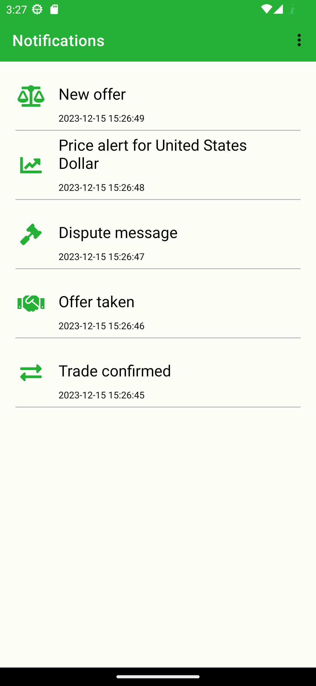
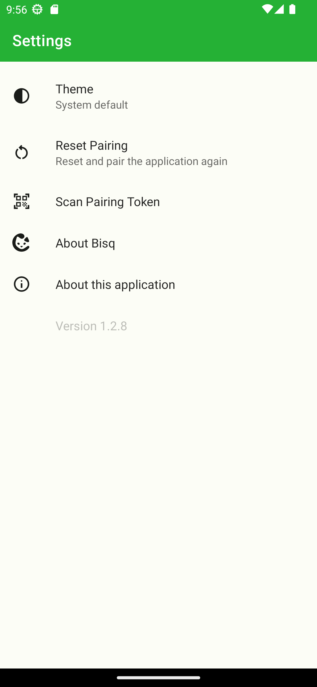

# Bisq Notification Android App

Since Bisq is a desktop-based application, this Android app enables you to pair it with your desktop
application and receive important notifications such as trade updates and offer alerts when you are
not near your computer.

## Prerequisites

In order to pair the app and receive notifications, you will need to obtain an appropriate
`google-services.json` file and place it under the app/ directory. Refer to
[firebase documentation](https://firebase.google.com/docs/android/setup#add-config-file)
for more information.

> Note, the `google-services.json` file needs to correspond to the `fcmServiceAccountKey.json`
> used by the [bisq-relay](https://github.com/bisq-network/bisq-relay) service.

## Architectural Design

For information on the architectural design, refer to the
[Bisq Remote Specification](https://github.com/bisq-network/bisqremote/wiki/Specification).

## Screenshots

