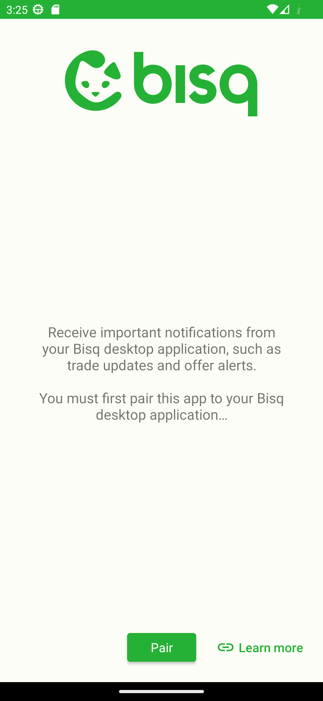

# Bisq Notification Android App

Since Bisq is a desktop-based application, this Android app enables you to pair it with your desktop
application and receive important notifications such as trade updates and offer alerts when you are
not near your computer.

## Updating Gradle Verification Metadata

Whenever dependencies change, it is necessary to update the contents of
`gradle/verification-metadata.xml`. This can be done automatically using the following command.

```shell
./gradlew --write-verification-metadata sha256 build :app:connectedDebugAndroidTest
```

> Using the `:app:connectedDebugAndroidTest` task ensures that all dependencies are updated.

## How to Run

In order to pair the app and receive notifications, you will need to create your own
`google-services.json` file and place it under the app/ directory. Refer to
[firebase documentation](https://firebase.google.com/docs/android/setup#add-config-file)
for more information.

## Architectural Design

For information on the architectural design, refer to the
[Bisq Remote Specification](https://github.com/bisq-network/bisqremote/wiki/Specification).

## Screenshots




